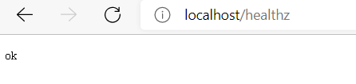

#####  Homework 1

编写一个 HTTP 服务器：

1. 接收客户端 request，并将 request 中带的 header 写入 response header

2. 读取当前系统的环境变量中的 VERSION 配置，并写入 response header

3. Server 端记录访问日志包括客户端 IP，HTTP 返回码，输出到 server 端的标准输出

4. 当访问 localhost/healthz 时，应返回200

import "github.com\golang\glog" error #Todo

Finally done, out put as below.

Output:

```http
Sec-Ch-Ua-Platform ["Windows"]
Upgrade-Insecure-Requests [1]
Sec-Fetch-Dest [document]
Accept-Encoding [gzip, deflate, br]
Sec-Ch-Ua ["Chromium";v="94", "Microsoft Edge";v="94", ";Not A Brand";v="99"]
Sec-Ch-Ua-Mobile [?0]
Sec-Fetch-Mode [navigate]
Sec-Fetch-User [?1]
Connection [keep-alive]
Accept [text/html,application/xhtml+xml,application/xml;q=0.9,image/webp,image/apng,*/*;q=0.8,application/signed-exchange;v=b3;q=0.9]
User-Agent [Mozilla/5.0 (Windows NT 10.0; Win64; x64) AppleWebKit/537.36 (KHTML, like Gecko) Chrome/94.0.4606.71 Safari/537.36 Edg/94.0.992.38]
Sec-Fetch-Site [none]
Accept-Language [zh-CN,zh;q=0.9,en;q=0.8,en-GB;q=0.7,en-US;q=0.6]
time: 2021-10-07 23-50-22, remote: [::1]:2785, status: 200
Sec-Fetch-Mode [no-cors]
Referer [http://localhost/]
Accept-Language [zh-CN,zh;q=0.9,en;q=0.8,en-GB;q=0.7,en-US;q=0.6]
User-Agent [Mozilla/5.0 (Windows NT 10.0; Win64; x64) AppleWebKit/537.36 (KHTML, like Gecko) Chrome/94.0.4606.71 Safari/537.36 Edg/94.0.992.38]
Sec-Ch-Ua-Platform ["Windows"]
Sec-Ch-Ua ["Chromium";v="94", "Microsoft Edge";v="94", ";Not A Brand";v="99"]
Sec-Ch-Ua-Mobile [?0]
Accept [image/webp,image/apng,image/svg+xml,image/*,*/*;q=0.8]
Sec-Fetch-Site [same-origin]
Sec-Fetch-Dest [image]
Accept-Encoding [gzip, deflate, br]
Connection [keep-alive]
time: 2021-10-07 23-50-22, remote: [::1]:2785, status: 200
Sec-Ch-Ua ["Chromium";v="94", "Microsoft Edge";v="94", ";Not A Brand";v="99"]
Sec-Ch-Ua-Mobile [?0]
User-Agent [Mozilla/5.0 (Windows NT 10.0; Win64; x64) AppleWebKit/537.36 (KHTML, like Gecko) Chrome/94.0.4606.71 Safari/537.36 Edg/94.0.992.38]
Sec-Ch-Ua-Platform ["Windows"]
Accept [image/webp,image/apng,image/svg+xml,image/*,*/*;q=0.8]
Sec-Fetch-Site [same-origin]
Referer [http://localhost/healthz]
Accept-Encoding [gzip, deflate, br]
Sec-Fetch-Mode [no-cors]
Sec-Fetch-Dest [image]
Accept-Language [zh-CN,zh;q=0.9,en;q=0.8,en-GB;q=0.7,en-US;q=0.6]
Connection [keep-alive]
time: 2021-10-07 23-51-00, remote: [::1]:2785, status: 200
Process finished with the exit code -1073741510 (0xC000013A: interrupted by Ctrl+C)
```

